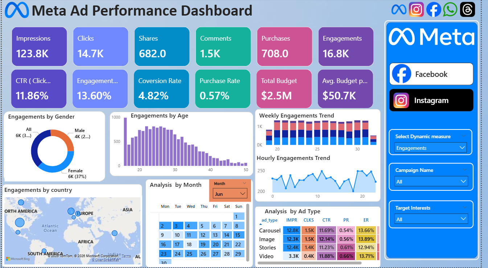

# Meta Ad Performance Dashboard

## Project Overview
This Power BI dashboard analyzes Meta (Facebook & Instagram) advertising performance and provides insights into engagement, clicks, conversions, purchases, and campaign effectiveness.

## Tools Used
- Power BI
- Power Query
- DAX
- Microsoft Excel

## Key Metrics
- Impressions
- Clicks
- CTR (Click Through Rate)
- Engagement Rate
- Conversion Rate
- Purchase Rate
- Budget Analysis

## Files Included
- Meta_Ad_Performance.pbix
- Meta_Ads_Data.csv
- Dashboard.png

## Dashboard Preview

## Business Insights

- Engagement rate remained strong across campaigns.
- CTR exceeded 11%, indicating effective ad targeting.
- Purchase conversions were relatively low compared to total impressions.
- Facebook and Instagram campaigns generated significant user interactions.
- Budget allocation can be optimized by focusing on high-converting campaigns.

## Project Highlights

- Built an interactive Power BI dashboard for Meta Ads performance analysis.
- Created KPI cards to track impressions, clicks, engagement, and purchases.
- Used DAX measures for calculating CTR, Conversion Rate, and Purchase Rate.
- Implemented dynamic filters for campaign-level analysis.
- Analyzed audience demographics, age groups, and geographic performance.
  
## Learning Outcomes

- Improved Power BI dashboard development skills.
- Gained hands-on experience with DAX calculations.
- Learned data transformation using Power Query.
- Developed KPI-driven business reporting techniques.
- Enhanced data visualization and storytelling skills.

## Skills Demonstrated

- Data Analysis
- Data Visualization
- Power BI
- DAX
- Power Query
- KPI Reporting
- Dashboard Design
- Marketing Analytics
- Business Intelligence
